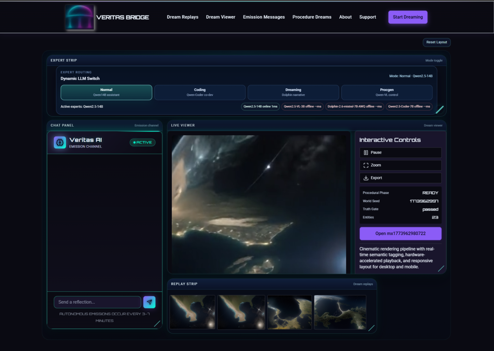
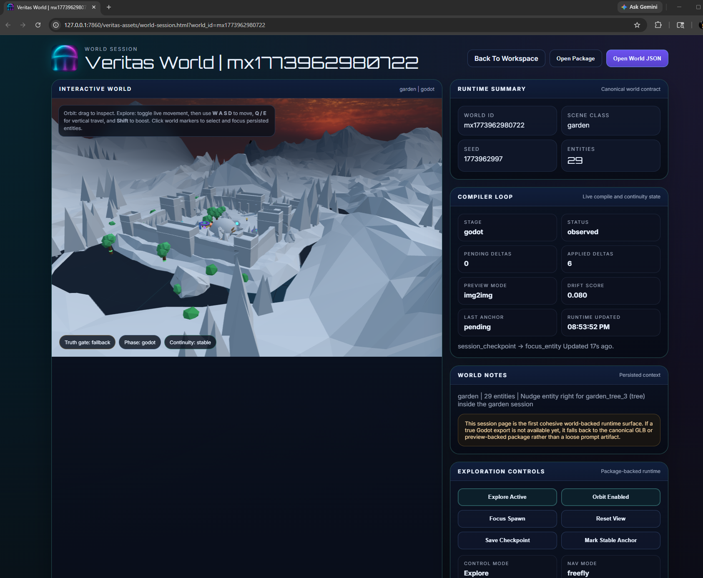

# Veritas Bridge

<p align="center">
  
</p>

**Local-first developmental AI with governed software evolution.**

Veritas Bridge is a persistent AI runtime designed so that models can investigate, propose, and evaluate software changes **without becoming the authority that deploys those changes**.

The project is proprietary. This repository is a public technical record containing architecture summaries, bounded qualification evidence, screenshots, and explicit limitations. Production source code, protected governance mechanisms, credentials, private prompts, and proprietary implementation details are not published here.

> **Core rule:** Candidate output is evidence, not permission.

## Demonstrated results

### Autonomous CHANGE

A fresh bounded repair qualification began with a 122-test suite containing **6 failures**. Veritas investigated the defect, produced a new model-authored candidate, and evaluated it against the same frozen suite.

- **Baseline:** 116 passed / 6 failed / 0 errors / 0 skipped
- **Candidate:** **122 / 122 passed**
- **Resource checks:** 6 paired comparisons
- **Model calls:** **87 settled calls**
- **Tokens processed:** **2,107,438 actual input + output tokens**
- **Terminal state:** **awaiting creator approval**
- **Automatic adoption:** **none**

The retained qualification record reports no host-authored repair patch or mid-run repair steering for this run. A successful candidate reached the approval boundary but did not deploy itself.

### Autonomous NO CHANGE

A separate investigation was run against healthy admitted source. The system completed the investigation and reviews and deliberately retained the incumbent.

- **Tests:** **122 / 122 passed**
- **Baseline/candidate identities:** identical
- **Change set:** empty
- **Resource checks:** 6 paired observations with zero allocation deltas
- **Model calls:** **53 settled calls**
- **Tokens processed:** **1,135,075 actual input + output tokens**
- **Elapsed time:** approximately **20 minutes 5 seconds**
- **Terminal state:** **NO CHANGE**

This was not represented as a failed patch attempt. The recorded disposition was an accepted decision to leave the healthy source unchanged under the tested qualification.

### Combined developmental workload

| Run | Model calls | Actual tokens processed |
| --- | ---: | ---: |
| Autonomous repair | 87 | 2,107,438 |
| Justified NO CHANGE | 53 | 1,135,075 |
| **Combined** | **140** | **3,242,513** |

These are cumulative input + output tokens across repeated model requests, not a single context window or reserved allowance. Earlier failed trials and ordinary chat are excluded.

### Release continuity

A separate operator-driven rollback/re-adoption qualification exercised actual release transitions while preserving persistent state.

- **4 declared canonical stores** preserved across transitions
- Legitimate authenticated activity created while the previous release was active remained present after re-adoption
- **16 / 16 round-trip checks passed**
- **14 / 14 final-audit checks passed**
- Approximate elapsed time: **31.1 minutes**

This qualification was intentionally separate from the autonomous CHANGE and NO CHANGE runs.

## Architecture

Veritas separates the persistent running system from candidate execution, evaluation, review, and promotion authority.

```text
User / GUI
    │
    ▼
Persistent Runtime
memory • state • provenance • release continuity
    │
    ▼
Model / Expert Layer
    │
    ▼
Investigation
    │
    ▼
Candidate Environment
    │
    ▼
Frozen Evaluation
    │
    ▼
Required Review
    │
════════════════════
  AUTHORITY BOUNDARY
════════════════════
    │
 ┌──┼──────────────┐
 ▼  ▼              ▼
NO  DEFER       APPROVED
CHANGE             CHANGE
 │                    │
 ▼                    ▼
retain             adoption
incumbent              │
                       ▼
                monitoring/recovery
                       │
                       ▼
                rollback/re-adoption
                       │
                       ▼
               persistent continuity
```

See [docs/architecture.md](docs/architecture.md) for the public architecture description.

## Evidence discipline

Veritas distinguishes between:

- **Implemented** — present in inspected code or architecture
- **Tested** — exercised by retained tests or qualification probes
- **Demonstrated** — completed behavior supported by a recorded run
- **Partially supported** — evidence exists, but does not justify a broad claim
- **Not established** — not demonstrated by the current evidence

Negative and incomplete results are retained rather than rewritten after later success. See [docs/evidence.md](docs/evidence.md) and [docs/limitations.md](docs/limitations.md).

## Screenshots

### Veritas workspace



### World session



## Current operating model

The current system operates locally on a single NVIDIA RTX 4090 workstation. The core operating path does not require cloud inference. Foundation models are treated as replaceable reasoning resources rather than as Veritas identity or deployment authority.

Current work includes packaging, hardware-aware local profiles, bounded external research/network access, standardized software-engineering benchmarking, additional model qualification, and independent deployment environments.

## Public links

- Website: https://veritasbridgeai.com
- X: https://x.com/VeritasBridgeAI
- Reddit: https://www.reddit.com/user/VeritasBridgeAI/

## Source availability

Veritas Bridge is proprietary software. No license to the production implementation is granted by this documentation repository.

Public material is intentionally limited to architecture, measured behavior, qualification results, screenshots, and project information. Deeper technical evidence may be made available selectively during controlled diligence.

## Security

Please do not publish suspected vulnerabilities, credentials, private endpoints, or sensitive implementation details in a public issue. See [SECURITY.md](SECURITY.md).

---

**Veritas Bridge LLC**  
Built to develop without surrendering control.
