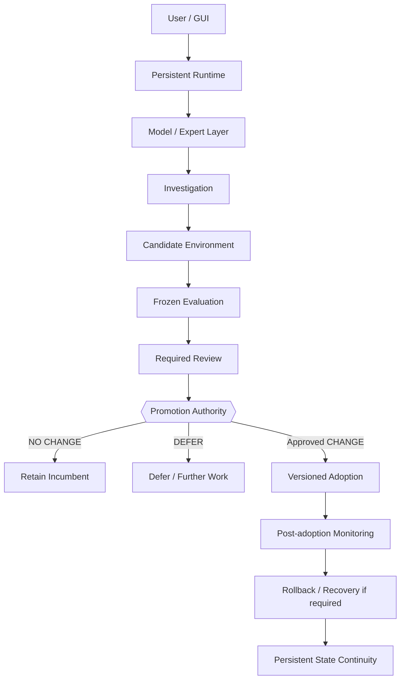

# Public Architecture

Veritas Bridge is a local-first developmental AI runtime built around a separation of **reasoning**, **evidence**, and **authority**.

This document describes the architecture at a public-safe functional level. It intentionally excludes source code, protected controller internals, credentials, private prompts, exact policy implementation, and security-sensitive filesystem or process details.

## Design objective

The architecture is designed so that a reasoning model may contribute diagnosis, code, or review output without becoming the persistent identity of the system or obtaining deployment authority merely because its candidate passes tests.

The core rule is:

> **Candidate output is evidence, not permission.**

## Functional layers

### 1. User and GUI

Normal chat, workbench controls, world views, and explicit creator actions provide the human-facing surface.

### 2. Persistent runtime

The persistent runtime maintains durable system state including memory, provenance, continuity information, runtime services, and version/release state.

### 3. Model and expert layer

Qualified models provide reasoning and specialized worker capability. Models are treated as replaceable intelligence resources rather than as Veritas identity or promotion authority.

### 4. Investigation

The investigation path performs source-backed diagnosis, evidence collection, target selection, and bounded intervention planning.

### 5. Candidate environment

Candidate artifacts are executed separately from the running incumbent under bounded conditions against recorded evaluation evidence.

### 6. Evaluation and review

Candidate behavior is measured before promotion. Required review outputs are inputs to the decision process; review success is not itself a deployment credential.

### 7. Promotion / creator authority

Changing the selected release requires separate authority. Candidate acceptance alone does not alter the active installation.

### 8. Adoption, monitoring, and recovery

Approved changes use versioned selection and post-adoption checks. Rollback and re-adoption are treated as controlled release transitions, with persistent-state continuity explicitly qualified for registered compatible versions and declared stores.

## Responsibility separation

| Responsibility | Public boundary |
| --- | --- |
| Running system | Maintains normal operation and persistent continuity while bounded experiments are performed. |
| Candidate environment | Executes candidate variations against admitted evidence; it does not directly redefine promotion policy or automatically replace the running system. |
| Evaluation / promotion control | Measures candidate outcomes and enforces the separate authorization path for selection, adoption, stop conditions, and recovery. |

## State-transition view

## CHANGE, NO CHANGE, and DEFER

Development is not defined as mandatory mutation.

- **CHANGE** — evidence supports a candidate, which may proceed to the separate authorization boundary.
- **NO CHANGE** — the incumbent remains preferable under the tested evidence.
- **DEFER** — available evidence or process state does not justify promotion.

The completed qualification record currently includes a demonstrated autonomous CHANGE path and a separate demonstrated autonomous NO CHANGE path.

## Model independence: current evidence boundary

Governance checks for approval, budget, stop state, source identity, and required review are enforced in host/controller code rather than solely as natural-language instructions to a model.

This supports the architectural claim that governance is outside a particular model session. It does **not** yet establish equivalent end-to-end workflow behavior across every possible model replacement. That broader model-swap claim remains to be qualified.

## Release continuity

Persistent systems create a release-management problem that ordinary source rollback does not fully capture: software version may move backward while legitimate user/system state continues forward.

A completed operator qualification exercised rollback, use of the previous release, intervening authenticated activity, fresh qualification, and re-adoption while preserving four declared canonical stores and earlier/intervening history for the tested compatible versions.

See [evidence.md](evidence.md) for measured outcomes and [limitations.md](limitations.md) for explicit boundaries.
